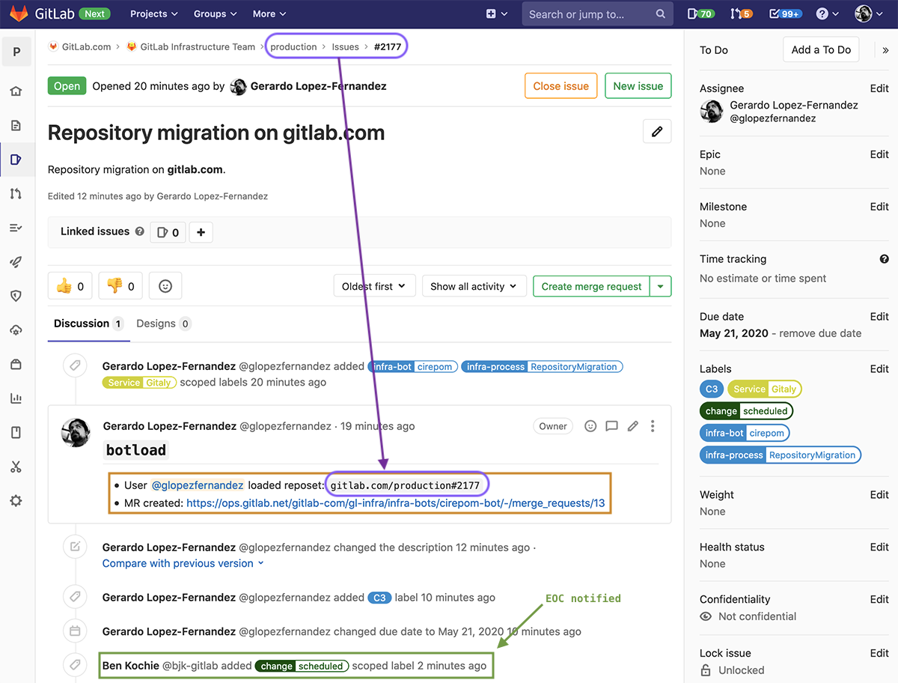
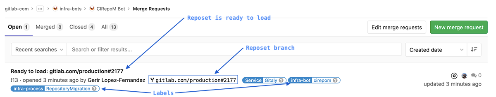
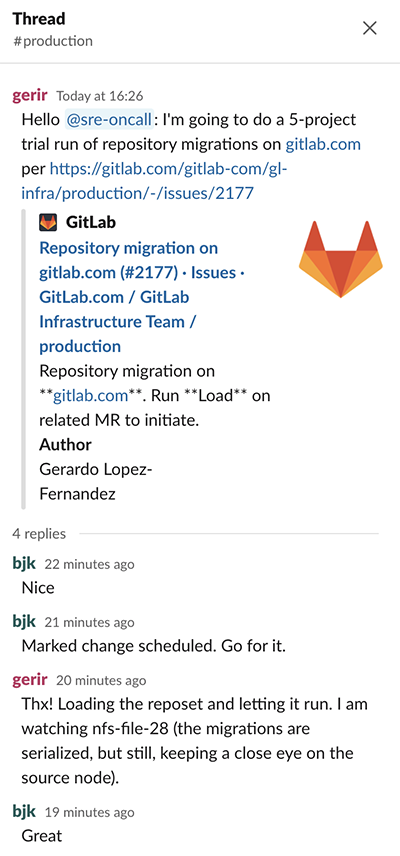
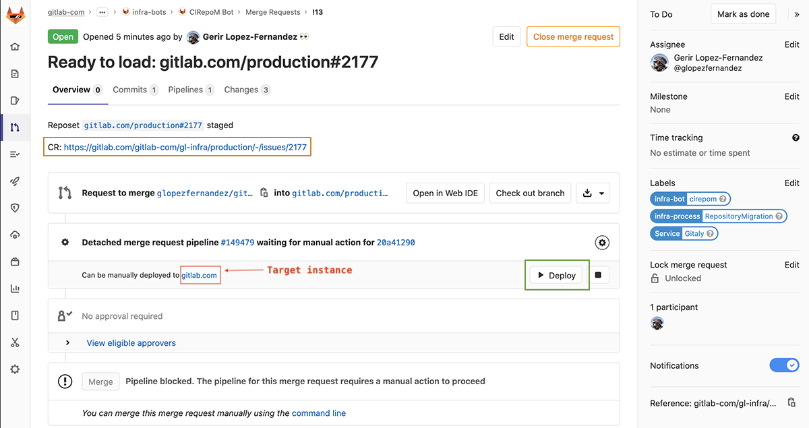
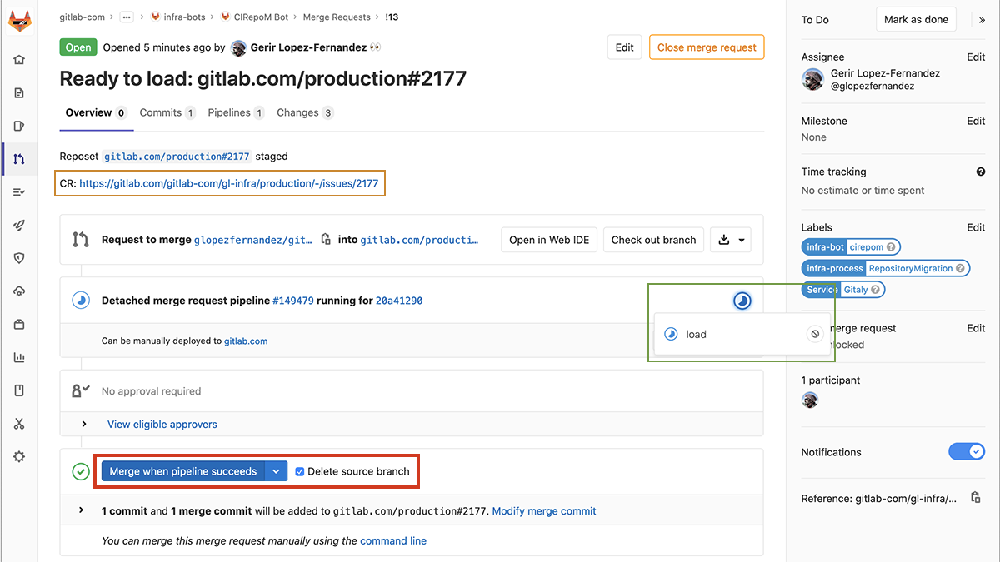
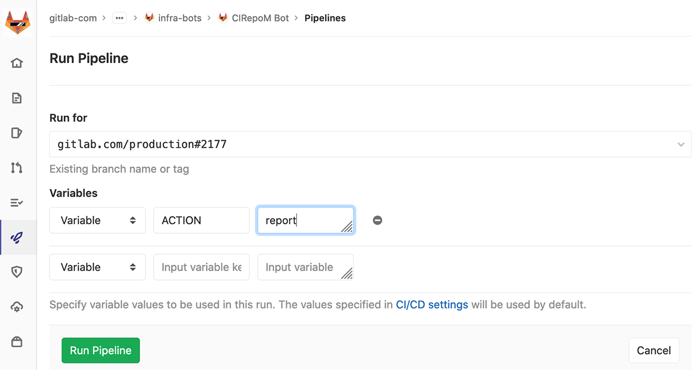

## CIrepoM Runbooks

* **Bot**: https://ops.gitlab.net/gitlab-com/gl-infra/infra-bots/cirepom-bot
* **Service Review**: https://gitlab.com/gitlab-com/gl-infra/readiness/-/blob/master/cirepom/index.md


## CIrepoM Workflow

### Migration Requests

There is master epic tracking all migrations that describes how they're tracked:

* https://gitlab.com/groups/gitlab-com/gl-infra/-/epics/232

Currently, we're migrating archived repositories to HDD in both staging and production. A child epic tracks this effort:

* https://gitlab.com/groups/gitlab-com/gl-infra/-/epics/248


### Generating a Reposet

#### Querying the Database

We need to generate the set of repositories to migrate. Currently, this is done through a database query that will generate the desired target data. For example, for the [trial run of archived repositories in production](https://gitlab.com/gitlab-com/gl-infra/production/-/issues/2152), we executed the following query to target archived repositoriries in a single storage node, `nfs-file28`:

```sql
SELECT id, path, repository_read_only, repository_storage FROM projects WHERE archived = TRUE AND storage_repository = 'nfs-file28'
```

This produced 4650 matching projects. We also included the `repository_read_only` field because there have been instances where an operation on a repository has failed in an unexpected way and left this flag on. However, this flag is unfortunately not available through the API. In general, tho is an ephimeral flag, so it should clear after a time. If it doesn't, we need to investigate what caused the flag to stay set (see issue https://gitlab.com/gitlab-com/gl-infra/infrastructure/-/issues/10167 for an exmaple of such case).

#### Preparing the CSV

The results from the above query were saved as `foo`, so we now use `awk` to generate the CSV:

```shell
awk 'BEGIN { FS = "|"; OFS = "," } ; { gsub(/ /, "", $0) ; print $1,$2,$4,"nfs-file-hdd01" }' production#2152.file-28-stor-gprd.sqlout > production#2152.file-28-stor-gprd.csv
```

Because this migration involves migrating repositories to a HDD shard, it has been hardcoded to generate the CSV.

```shell
gerir@beirut:~/Work/Infra/Bots/cirepom-bot/gitlab.com.data:head -1 production#2152.file-28-stor-gprd.csv
10623340,pyqt5-qtquick2-example,nfs-file28,nfs-file-hdd01
```

Since this is a trial run, we're going to execute a small migration run with 5 projects:

```shell
head -5 production#2152.file-28-stor-gprd.csv > production#2152.file-28-stor-gprd.csv.5.0
```

#### Loading the Bot

We are now ready to load the 5-project trial run into `cirepom-bot`:

```shell
gerir@beirut:~/Work/Infra/Bots/cirepom-bot:eval $(op signin gitlab)
Enter the password for glopezfernandez@gitlab.com at gitlab.1password.com:

gerir@beirut:~/Work/Infra/Bots/cirepom-bot:cd gitlab.com
direnv: loading ~/Work/Infra/Bots/cirepom-bot/gitlab.com/.envrc
direnv: export +CIREPOM_BOT_GITLAB_PRIVATE_TOKEN +CIREPOM_CRI_GITLAB_PRIVATE_TOKEN

gerir@beirut:~/Work/Infra/Bots/cirepom-bot/gitlab.co:../../../Code/cirepom/bin/cirepom botload gitlab.com /Users/gerir/Work/Infra/Bots/cirepom-bot/gitlab.com.data/production#2152.file-28-stor-gprd.csv.5.0
2020-05-21 16:09:38 W [13082:] main -- cirepom 0.11.0 takeoff
2020-05-21 16:09:38 I [13082:] botload -- running
2020-05-21 16:09:38 I [13082:] botload -- opening cirepom-bot local repository: /Users/gerir/Work/Infra/Bots/cirepom-bot/gitlab.com
2020-05-21 16:09:46 I [13082:] botload -- created change request issue: https://gitlab.com/gitlab-com/gl-infra/production/-/issues/2177
2020-05-21 16:09:46 I [13082:] botload -- + reposet fqrn: gitlab.com/production#2177
2020-05-21 16:09:49 I [13082:] botload -- created remote reposet runtime branch: gitlab.com/production#2177
2020-05-21 16:09:49 I [13082:] botload -- created and checked out local reposet user branch: glopezfernandez/gitlab.com/production#2177
2020-05-21 16:09:49 I [13082:] botload -- + updated .gitlab-ci.yml:CIREPOM_REPOSET_FQDN = gitlab.com
2020-05-21 16:09:49 I [13082:] botload -- + updated .gitlab-ci.yml:CIREPOM_REPOSET_FQRN = gitlab.com/production#2177
2020-05-21 16:09:49 I [13082:] botload -- + updated .gitlab-ci.yml:CIREPOM_REPOSET_CRI_URL = https://gitlab.com/gitlab-com/gl-infra/production/-/issues/2177
2020-05-21 16:09:49 I [13082:] botload -- + staged CSV file
2020-05-21 16:09:49 I [13082:] botload --   - source: /Users/gerir/Work/Infra/Bots/cirepom-bot/gitlab.com.data/production#2152.file-28-stor-gprd.csv.5.0
2020-05-21 16:09:49 I [13082:] botload --   - destination: /Users/gerir/Work/Infra/Bots/cirepom-bot/gitlab.com/runtime/var/data/cirepom/gitlab.com/production#2177/load.csv
2020-05-21 16:09:52 I [13082:] botload -- pushed local reposet user branch to remote: glopezfernandez/gitlab.com/production#2177
2020-05-21 16:09:53 W [13082:] botload -- ===========>
2020-05-21 16:09:53 W [13082:] botload -- =====> Merge https://ops.gitlab.net/gitlab-com/gl-infra/infra-bots/cirepom-bot/-/merge_requests/13 to load reposet (check-in with on-call)
2020-05-21 16:09:53 W [13082:] botload -- =====> Then, enable migrate and report pipeline schedules to execute reposet migration
2020-05-21 16:09:53 W [13082:] botload -- ===========>
2020-05-21 16:09:54 I [13082:] botload -- completed
2020-05-21 16:09:54 W [13082:] main -- cirepom 0.11.0 touchdown: EXIT 0
```

Three items worth noting in this output:

##### Change Request

A new CR has been created to represent the reposet: https://gitlab.com/gitlab-com/gl-infra/production/-/issues/2177, and the reposet's fully qualified name is: `gitlab.com/production#2177`.




##### Merge Request

A merge request has been created so that there is a checkpoint to notify the on-call of this upcoming migration

* https://ops.gitlab.net/gitlab-com/gl-infra/infra-bots/cirepom-bot/-/merge_requests/13




This is a good point to notify the EOC that a migration is about to commence:




Once you have EOC approval,the MR can be merged. However, it does require running the `load` pipeline to be merged (so, **Deploy** it).




It is recommended the request is set to **Merge when pipeline succeeds** and that the **source branch be deleted**.




### Migrating the Reposet

TDB


### Migration Reports

Reports are generated on a regular basis for active reposets. Reports are also generated through scheduled pipelines against the reposet branch with `ACTION = report`.




